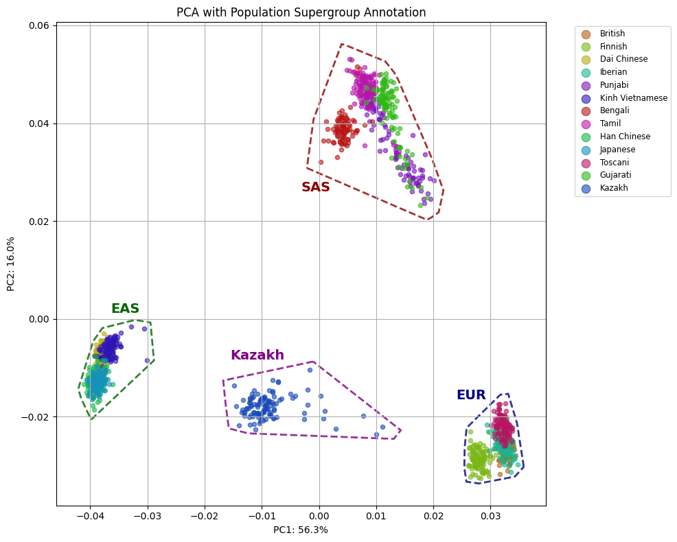
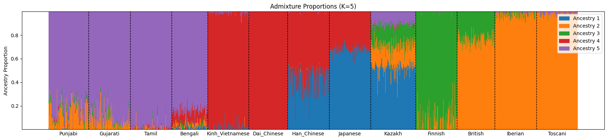
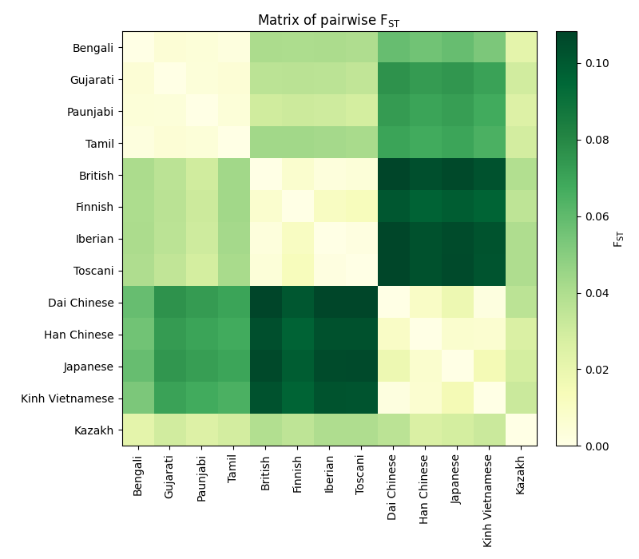

# Integrative Genomic Study of Kazakh Exomes in the Context of Global Populations

This repository contains the complete workflow, scripts, and results for a population genetics study of Kazakh exomes. The analysis integrates quality control, variant calling, and comparative analysis with data from the 1000 Genomes Project to investigate the genetic structure and ancestry of the Kazakh population.

## Project Overview

This study aims to characterize the genetic landscape of the Kazakh population by:

- Processing and performing quality control on raw exome sequencing data.
- Calling and annotating genetic variants to identify high-quality SNPs and indels.
- Merging the Kazakh exome data with a global reference panel from the 1000 Genomes Project.
- Conducting population structure analyses, including Principal Component Analysis (PCA), ADMIXTURE, and Fixation Index (Fst) to understand the genetic relationships.
- Performing variant-level statistics and assessing data quality through missingness and heterozygosity analysis.

The project workflow is implemented through a series of shell commands, Python scripts, and Jupyter notebooks, with detailed protocols available in markdown files.

## Repository Structure

- **`variant_calling.md`**: A step-by-step protocol for raw data quality control, read alignment (BWA), variant calling (GATK), and annotation.
- **`plink_initial.md`**: Details the initial steps of creating PLINK datasets from VCF files and quality control.
- **`plink_qc.ipynb`**: Jupyter notebook for plotting quality control results of PLINK files, including missingness, sex check, HWE, MAF, and ROH analysis.
- **`1000_gen_qc.md`**: A guide for processing, filtering, and merging genotype data with the 1000 Genomes dataset using PLINK.
- **`pca_clustering_fst_admixture.md`**: A guide for downstream analyses including PCA, clustering, FST, and ADMIXTURE.
- **`qc_titv.ipynb`**: Notebook for calculating and plotting the Ti/Tv ratio of variants.
- **`shared_vars_and_missingness.ipynb`**: A notebook for analyzing shared variants and missingness statistics.
- **`vcf_stats.py`**: A Python script for computing summary statistics from VCF files.
- **`plot_fst.py`**: Python script to plot Fst matrix.
- **`pca_plots/`**, **`clustering_plots/`**, **`admixture_plots/`**, **`qc_plots/`**: Directories containing visualizations of the analysis results.
- **`FILES/`**: Contains input data files for the analysis.

## Analysis Workflow

The analysis is divided into several key stages:

### 1. Raw Data Quality Control and Preprocessing
- **Quality Assessment**: Raw sequencing reads are assessed for quality using FastQC.
- **Trimming**: Trimmomatic is used to remove adapters and low-quality reads.
- **Alignment**: Reads are aligned to the hg38 reference genome using BWA.
- **Preprocessing**: SAM/BAM files are processed, sorted, and indexed with SAMtools. GATK is used to add read groups, mark duplicates, and perform Base Quality Score Recalibration (BQSR).

### 2. Variant Calling and Annotation
- **Variant Discovery**: GATK HaplotypeCaller is used for initial variant discovery.
- **Joint Genotyping**: Samples are merged into a cohort VCF through joint genotyping.
- **Filtering and Annotation**: Hard filters are applied to SNPs and indels, and variants are annotated with dbSNP rsIDs.

### 3. Data Harmonization with 1000 Genomes
- **PLINK Conversion**: VCF files are converted to PLINK format.
- **QC and Filtering**: Both Kazakh and 1000 Genomes datasets are filtered for missingness (`--mind`, `--geno`), minor allele frequency (`--maf`), and Hardy-Weinberg Equilibrium (`--hwe`).
- **SNP Matching**: Variants are matched between the two datasets to create a common set of SNPs.
- **Harmonization**: The datasets are harmonized by updating chromosome coordinates, setting a uniform reference allele, and flipping strands to resolve mismatches.
- **Outlier Removal**: PCA is used to identify and remove genetic outliers from the Kazakh cohort.
- **LD Pruning**: Linkage disequilibrium (LD) pruning is performed to ensure SNPs are independent for population structure analyses.

### 4. Population Genetics and Comparative Analysis
- **Principal Component Analysis (PCA)**: PCA is performed to investigate population structure.
- **ADMIXTURE Analysis**: ADMIXTURE is used to infer ancestry components, with cross-validation to determine the optimal number of ancestral populations (K).
- **Fixation Index (Fst) Calculation**: Pairwise Fst values are calculated to quantify genetic differentiation between populations.

## Key Findings

- **Genetic Structure**: PCA places the Kazakh population on a clear East-West Eurasian axis, intermediate between European and East Asian clusters. PC2 further separates South Asian populations. 
- **Admixture Analysis**: The ADMIXTURE model with K=5 reveals that the Kazakh genome is a composite of multiple ancestral components, including East Asian, European, and South Asian lineages. 
- **Population Differentiation (Fst)**: Fst values indicate that the Kazakh population is genetically closest to South Asian groups and most distant from European and East Asian populations, confirming its admixed nature. 